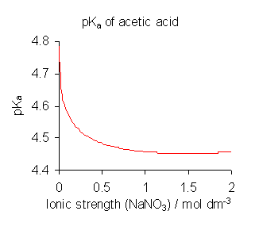

# Overview:
The goal of this blog post is to <ins>Calculate potential and pH-dependent equilibrium potentials of anion specific adsorption on metals using DFT.</ins>

# Review: pKa and pH

The adsorption of anions are dependent on the pH of the solution. The acid dissociation constant ($K_a$) is crucial in understanding the form of the anion upon adsorption at the surface. The strength of the acid is based on the equilibrium constant of acid dissociation given as:

$$ HA_{(aq)} \leftrightarrow A^-_{(aq)} + H^+_{(aq)} $$

where $A^-$ is the conjugate base of the acid and $H^+$ is the proton in solution. All species are in the solution-phase for clarity. The equilibrium constant, $K_a$, is defined as:


$$
K_a = \frac{[A^-][H^+]}{[HA]}
$$

where a higher $K_a$ corresponds to a stronger acid (more dissociated at equilibrium). Assuming concentrations are sufficient for an ideal solution (activities are equivalent to the concentrations), the pKa is defined as:

$$ pK_a = -log_{10}K_a$$

where this convenient scale defines lower $pK_a$ as stronger acids (larger $K_a$).

## Ideality and Activities
Note that ideality was assumed, where concentrations are sufficient $[X]$. In a solution with varying ionic strengths, temperatures, compositions, and pressures, this is assumption is not always true. The Figure below shows a case of acetic acid is dependent on the ionic strength, where ideality deviates with stronger ionic solutions [https://en.wikipedia.org/wiki/Acid_dissociation_constant].



The activity, $\alpha$ , is a measure of the "effective concentration" or "real concentration". In the simplest form, the activity of any species at equilibrium is defined as:

$$ \{X\}=[X]\gamma_X$$

where the general form of the activity of any species is given as $\{X\}$ and the activity coefficient is  $\gamma_X$ that measures the ideality of species X. An activity coefficient of one indicates complete ideality. 

$K_a$ can be corrected by using the activity coefficients of each species, defined as $\gamma_i$, can be corrected to account for the non-ideality of the solution as follows:

$$ K^\Theta = K_a\Gamma = K_a\frac{\gamma_A^- \gamma_H^+}{\gamma_{HA}}=\frac{[A^-][H^+]}{[HA]}\frac{\gamma_A^- \gamma_H^+}{\gamma_{HA}}$$

where $\Gamma$ is the activity quotient for the reaction. Henry's and Raoult's law are used to provide a estimates of the activity coefficient. 


## Proton Affinity
Note that K$_a$ requires the knowledge of the enthalpic, entropic, and solvation contributions during the dissociation of an acid. A simple metric based on purely the enthalpic components is the proton affinity defined as:

$$ HA_{(g)} \rightarrow A^-_{(g)} + H^+_{(g)} $$

where all species are in the gas-phase rather than bulk solution. This is proton affinity is also known as gas-phase basicity. The proton affinity (a positive value) measures the intrinsic property of a molecule given as:

$$ E_{PA}=E_{A^-_{(g)}} + E_{H^+_{(g)}} - E_{HA_{(g)}}$$

where larger proton affinities, (More stable HA and less stable $A^-$ ) means stronger base or weaker acid. Note that the energies of each species are not written as free energies. 
# Equilibrium Potentials of Anion Specific Adsorption

Specific adsorption of anions are dependent on the pH of the solution. We derive the equilibrium adsorption potential for both high and low pH solutions relative to the pKa of the anion of interest. 

## High pH Case

When the pH is higher than the pKa, HA has dissociated into $A^-$. Anions ($A^-$) specifically adsorb on a metal surface describe by the following reaction:

$$ A^-_{(aq)}+ * \rightarrow A^*_{(aq)} + e^-$$

where the aqueous anion undergoes electron transfer upon adsorption and (partially) desolvates. The potential-dependent free energy change of this reaction is written as the form as:

$$\Delta G_{ads}(U_{abs})=G_{A^*_{(aq)}} + G_{e^-} - G_{A^-_{(aq)}} - G_{*_{(aq)}}$$ 

The free energy change of the adsorbed anion, $A^*$ is generally defined as:

$$ G_{i_{(g)}} = E_{i,DFT} + E_{ZPVE} + TS_{vib}$$

where the DFT Enthalpy at 0 K is $E_i$, the zero point energy is $E_{ZPVE}$ , and$TS_{vib}$ is the entropic corrections. At a first approximation, the latter two terms are determined from DFT from both a harmonic oscillator approximation and vibrational calculations. 

Approximating the solvation free energy change during specific adsorption is challenging. Here, we define the solvation free energy change for specific anion adsorption as:

$$ \Delta\Delta G_{solv} = \Delta G_{solv,A*} -\Delta G_{solv,*} - \Delta G_{solv,A^-} $$

where the solvation energy of each species is generally defined as:

$$\Delta G_{solv,i} = G_{i_{(aq)}}-G_{i_{(g)}}$$

The solvation energy of $A^-$ in theory should be potential-independent as it is in the bulk solution far away from the electrode. The solvation energy of $A^*$ and the bare metal can be potential-dependent and are ill-defined.
Here, we assume these solvation contributions are potential-independent to rewrite the free energy change of specific anion adsorption as:

$$\Delta G_{ads}(U_{abs})=G_{A^*_{(g)}} + G_{e^-} - G_{A^-_{(g)}} - G_{*_{(g)}}+\Delta\Delta G_{solv}$$

Note that the free energy of the electron is simply defined as:
$$G_{e^-}=-|e|U_{abs}$$
where e is the electron charge and the $U$$_{abs}$ is the electrode on the absolute potential. 
The equilibrium potential, $U$$^0$ is insightful in predicting the potential at which anions would adsorb. This occurs when the free energy change of adsorption is at zero defined as: 

$$\Delta G_{ads}(U^0_{abs})=0=G_{A^*_{(g)}} -|e|U^0_{abs} - G_{A^-_{(g)}} - G_{*_{(g)}}+\Delta\Delta G_{solv}$$

$$U^0_{abs}=\frac{G_{A^*_{(g)}} - G_{A^-_{(g)}} - G_{*_{(g)}}+\Delta\Delta G_{solv}}{|e|}$$

where $U$$^0$$_{abs}$ is the equilibrium potential on the absolute scale. Experimental electrochemical measurements are not relative the absolute scale (electron in vacuum) but, for example, to the standard hydrogen electrode. The equilibrium potential on an absolute scale can simply be converted to a relevant potential by defining:

$$U^0_{SHE} = U^0_{abs} + \Delta U_{abs \rightarrow SHE}$$

$$U^0_{SHE} =\frac{G_{A^*_{(g)}} - G_{A^-_{(g)}} - G_{*_{(g)}}+\Delta\Delta G_{solv}}{|e|} + \Delta U_{abs \rightarrow SHE}$$

where the conversion from U-abs to U-SHE ranges from -4.2 to 5.0 V-SHE. Finally, we have derived the equilibrium adsorption potential on an SHE from DFT for the case of high pH.

## Low pH Case

When the pH is lower than the pKa, HA is more stable in solution. Specific adsorption of the anion occurs simultaneous deprotonation and electron transfer onto a metal surface defined as:

$$ HA_{(aq)}+ * \rightarrow A^*_{(aq)} + e^- + H^+ $$

where the aqueous anion undergoes electron transfer upon adsorption and (partially) desolvates. The free energy change of this reaction is written as the form as:

$$\Delta G_{ads}(U_{abs})=G_{A^*_{(aq)}} + G_{e^-} + G_{H^+}- G_{HA_{(aq)}} - G_{*} $$

$$\Delta G_{ads}(U_{abs})=G_{A^*_{(aq)}} -|e|U_{abs} + G_{H^+}- G_{HA_{(aq)}} - G_{*} $$

Less derivations will be shown but it is important to define the free energy of the proton. We will discuss two methods: 1) defining the energy of the proton in bulk solution and 2) the computational Hydrogen electrode.

### Defining the Proton's Gibbs Free Energy (SHE):

In it's simplest form for pH-independence, the free energy of the proton in bulk solution is defined as:
$$ G_{H^+_{(aq)}} = G_{H^+_{(g)}} + \Delta G_{H^+,solv}$$ 

This value carries uncertainty as it is highly dependent on the free energy of the proton, which is challenging to quantify experimentally and requires thermodynamic assumptions. Regardless, the equilibrium adsorption potential on an SHE scale can be calculated as 

$$\Delta G_{ads}(U^0_{abs})= 0=G_{A^*_{(aq)}} -|e|U^0_{abs} + G_{H^+}- G_{HA_{(aq)}} - G_{*} $$

$$U^0_{abs}=\frac{G_{A^*_{(aq)}} + G_{H^+}- G_{HA_{(aq)}} - G_{*}}{|e|} $$

which $U$$^0$ can be converted to the SHE scale as defined previously.  
### The Computational Hydrogen Electrode (RHE)

An alternative method to determining the free energy of the proton in bulk solution is to use the Computational Hydrogen Electrode (CHE) Approach, which uses the well-defined reversible hydrogen electrode (RHE). This defines the free energy or chemical potential of both the proton in bulk solution and electron as:

$$\mu_{H^+} +\mu_{e^+} = \frac{1}{2}G_{H_2,(g)} - |e|U_{RHE} $$ 

where it utilizes the fact that protons and electrons are at equilibrium with $H_2$ gas at 0 V-RHE. The latter term accounts for the linear deviation from this 0 V-RHE. 

We can determine the equilibrium adsorption potential using the CHE approach as follows:

$$\Delta G_{ads}(U^0_{RHE})= 0=G_{A^*_{(aq)}} + \frac{1}{2}G_{H_2,(g)} - |e|U_{RHE}- G_{HA_{(aq)}} - G_{*} $$

$$U^0_{RHE}=\frac{G_{A^*_{(aq)}} + \frac{1}{2}G_{H_2,(g)}- G_{HA_{(aq)}} - G_{*}}{|e|} $$

where the equilibrium adsorption potential is determined on a RHE scale. The RHE depends on the pH so conversion back to SHE is possible using the Nernst Equation:

$$U^0_{RHE} = U^0_{SHE} - 0.059pH$$

$$U^0_{SHE} = U^0_{RHE} + 0.059pH$$

Now the low-pH (pH dependent) and the high pH (non-pH dependent) cases of anion adsorption can be calculated. 

## Visual aid of conceptualizing equilibrium adsorption potential
The following Jupyter notebook visually shows how varying the equilibrium adsorption potential introduces new potential regimes where anions can adsorb (the green).

```liquid
{::nomarkdown}



  

  <p>Sorry, the notebook you are looking for does not exist.</p>

{:/nomarkdown}
```

## Considerations of the Electrochemical Double Layer and Constant Potential

Here, the simulations are performed at constant charge (fixed number of electrons), where in experimental set ups are performed at constant potential (varying number of electrons). These can be corrected using Grand Canonical DFT approaches. 

More information to learn about our Analytical Grand Canonical DFT approach can be read more at [my GitHub Repository.](https://github.com/andrewjarkwahwong/dft-electrocatalysis-Janik)

